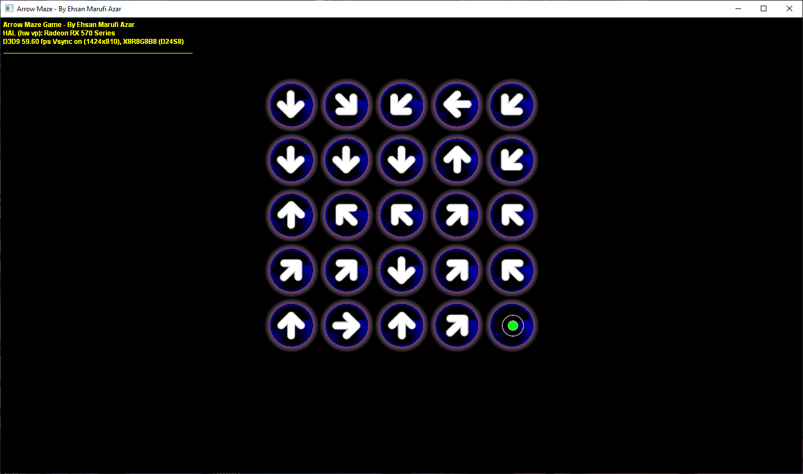

# Arrow Maze through pure Direct3D in C++

The Arrow Maze C++ implementation provides a convenient API for creating such puzzles. In the provided Visual Studio project, the API is used to quickly generate an Arrow Maze puzzle and display the UI in pure Direct3D.

All the code is released to Public Domain. Patches and comments are welcome.
It makes me happy to hear if someone finds the algorithms and the implementations useful.

Ehsan Marufi 
January 2013
